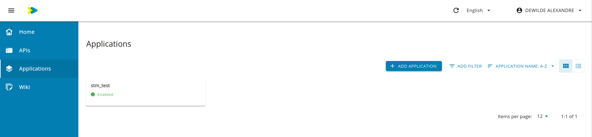
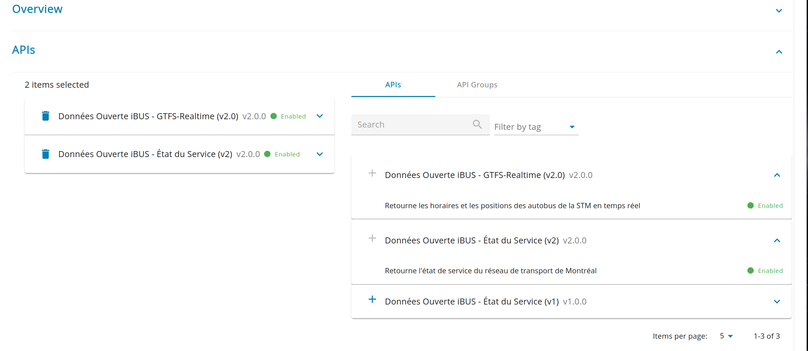
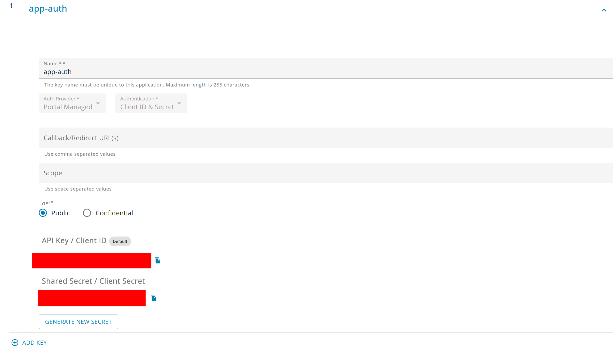

# Installation Guide

> **Warning**: These instructions are primarily intended for **Linux** environments. macOS has not been thoroughly tested, and these instructions are not suitable for Windows.

This guide provides instructions for setting up the MTL Finder application. You can choose between a fully automated script or a manual installation process.

## Prerequisites

Before you begin, ensure you have the following installed:

- **Python 3.10 or higher**
- **[UV](https://docs.astral.sh/uv/)**: A fast Python package manager.
  ```bash
  curl -LsSf https://astral.sh/uv/install.sh | sh
  ```
- **[Docker](https://docs.docker.com/get-docker/)**: For running OpenTripPlanner and Photon geocoding services.

## API Keys

You will need API keys from two services:

1.  **Mistral AI**: Powers the natural language understanding.
    -   **Get your key**: [Mistral AI Console](https://console.mistral.ai/)

2.  **STM (Société de transport de Montréal)**: Provides real-time public transit data.
    -   **Get your key**: [STM Developer Portal](https://portail.developpeurs.stm.info/apihub)
    -   After registering, create an application to get your API key. Make sure to use the **API key**, not the `client_secret`.

    #### Step-by-step Guide to get your STM key:

    1.  **Navigate to the "Applications" section.**
        

    2.  **Create a new application and add APIs needed.**
        

    3.  **Create your API key in the application details and copy API key.**
        


## Option 1: Scripted Installation (Recommended)

The `setup.sh` script automates the entire installation process.

1.  **Clone the Repository**:
    ```bash
    git clone git@github.com:AlexandreDewilde/montreal-transit-chatbot.git
    cd mistral-project
    ```

2.  **Run the script**:
    ```bash
    chmod +x setup.sh
    ./setup.sh
    ```

3.  **Follow the prompts**:
    -   The script will ask for your **STM** and **Mistral AI** API keys.
    -   It will create the `.env` file with your keys.
    -   It will download the necessary data for OpenTripPlanner (GTFS and OSM).
    -   It will create the OTP configuration files (`build-config.json` and `router-config.json`).
    -   It will install all Python dependencies for the backend and frontend using `uv`.

## Option 2: Manual Installation

If you prefer to set up the project manually, follow these steps.

### 1. Clone the Repository

```bash
git clone git@github.com:AlexandreDewilde/montreal-transit-chatbot.git
cd mistral-project
```

### 2. Configure Environment Variables

Create a `.env` file in the root of the project:

```bash
cp .env.example .env
```

Open the `.env` file and and add your API keys:

```
# Backend
API_URL=http://localhost:8000
API_PORT=8000
LOG_LEVEL=INFO
CORS_ORIGINS=http://localhost:8501,http://127.0.0.1:8501

# Frontend
FRONTEND_PORT=8501

# Mistral AI
MISTRAL_API_KEY=your_mistral_key_here
MISTRAL_MODEL=mistral-small-latest

# STM Real-time API
STM_API_KEY=your_stm_key_here

# Services
PHOTON_URL=http://localhost:2322
OTP_URL=http://localhost:8080/otp/gtfs/v1
```

### 3. Install Dependencies

Install the Python dependencies for both the backend and frontend using `uv`.

**Backend:**
```bash
cd src/backend
uv sync
```

**Frontend:**
```bash
cd ../frontend
uv sync
cd ../.. 
```

### 4. Set Up OpenTripPlanner

This setup involves downloading transit data and creating configuration files.

1.  **Create the data directory**:
    ```bash
    mkdir -p otp-data
    ```

2.  **Download the data**:
    -   **STM GTFS**:
        ```bash
        curl -L "https://www.stm.info/sites/default/files/gtfs/gtfs_stm.zip" -o otp-data/stm.gtfs.zip
        ```
    -   **Quebec OSM**:
        ```bash
        curl -L "https://download.geofabrik.de/north-america/canada/quebec-latest.osm.pbf" -o otp-data/quebec.osm.pbf
        ```

3.  **Create Configuration Files**:

    -   **`otp-data/build-config.json`**:
        This file configures how OTP builds its graph. Note that `"${STM_API_KEY}"` should be replaced with your actual STM API key if you are not using the `setup.sh` script.
        ```json
        {
          "areaVisibility": true,
          "parentStopLinking": true,
          "osmWayPropertySet": "default",
          "elevationUnitMultiplier": 1,
          "boardingLocationTags": [
            "ref",
            "name"
          ],
          "updaters": [
            {
              "type": "vehicle-rental",
              "sourceType": "gbfs",
              "network": "BIXI",
              "url": "https://gbfs.velobixi.com/gbfs/gbfs.json",
              "frequencySec": 60
            },
            {
              "type": "stop-time-updater",
              "frequencySec": 30,
              "sourceType": "gtfs-http",
              "url": "https://api.stm.info/pub/od/gtfs-rt/ic/v2/tripUpdates",
              "feedId": "STM",
              "headers": {
                "apikey": "${STM_API_KEY}"
              }
            }
          ]
        }
        ```

    -   **`otp-data/router-config.json`**:
        This file configures OTP's routing behavior.
        ```json
        {
          "routingDefaults": {
            "walkSpeed": 1.3,
            "bikeSpeed": 5.0,
            "carSpeed": 40.0,
            "numItineraries": 5,
            "transferPenalty": 0,
            "waitReluctance": 0.95,
            "walkReluctance": 2.0,
            "stairsReluctance": 1.65,
            "walkBoardCost": 60,
            "allowBikeRental": true,
            "bikeRentalPickupTime": 60,
            "bikeRentalDropoffTime": 30,
            "maxTransfers": 5,
            "searchWindow": "2h",
            "itineraryFiltering": 1.5
          },
          "timeout": 10,
          "requestLogFile": "/var/otp/requestLog.csv"
        }
        ```

### 5. Set Up Photon Geocoding

Photon converts location names to coordinates using OpenStreetMap data.

1.  **Start Photon**:
    ```bash
    docker compose -f docker-compose.photon.yml up -d
    ```

2.  **Wait for initialization**:
    The first startup will download Canada geocoding data (~8GB, takes ~10 minutes).
    Monitor the logs:
    ```bash
    docker logs -f photon-geocoder
    ```
    Wait until you see: `Photon startup successful`

3.  **Verify the service**:
    Test the geocoding API:
    ```bash
    curl "http://localhost:2322/api?q=Old+Montreal"
    ```
